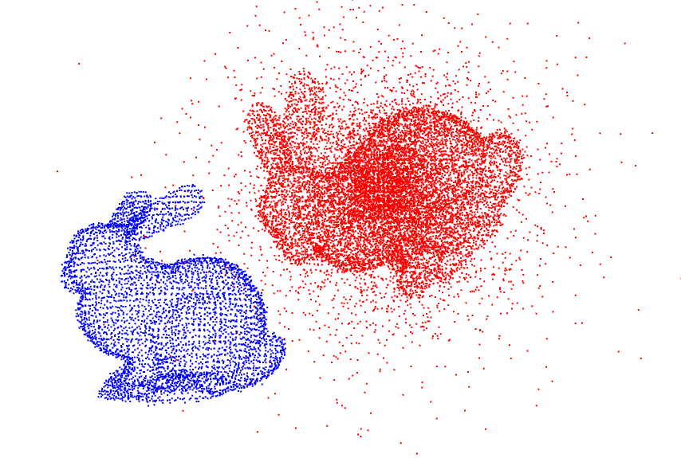

This repository contains the code written as part of the final project for MVA's point cloud processing course ("Nuage de points et Modelisation 3D").

It is based on TEASER++ (paper: https://arxiv.org/abs/2001.07715, code: https://github.com/MIT-SPARK/TEASER-plusplus). It also uses feature detectors: FCGF (https://github.com/chrischoy/FCGF/tree/master/scripts) and 3DSmoothNet (https://github.com/zgojcic/3DSmoothNet).

To run the code, please make sure you have installed TEASER++ Python wrapper before (follow the instructions from the original Github repo).

* generate_noise.py : takes a point cloud and generates a noiy and transformed version of the point cloud with added outliers
* scale_experiment.py : tests for different values of voxel grid how TEASER++ behaves
* lidar_odometry.py : small LIDAR experiment
